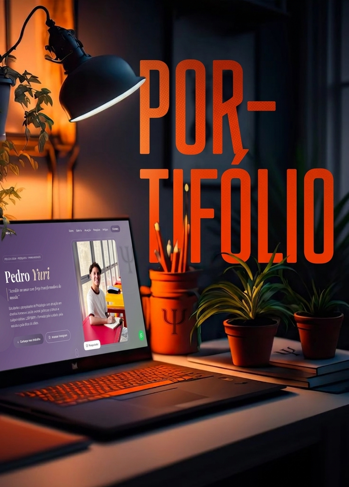

# 🧠 Pedro Yuri | Psicologia, Pesquisa & Humanidade

Portifólio moderno, responsivo e humanizado desenvolvidao para apresentar o trabalho acadêmico, científico e social de Pedro Yuri — estudante e pesquisador de Psicologia.

O projeto foi construído com foco em **design emocional**, **experiência do usuário (UX)** e **identidade visual sensível**, refletindo valores como cuidado, ética e humanidade.

---

## 🌐 Preview

🔗 Acesse o projeto:
👉 https://seu-link-aqui.com



---

## ✨ Sobre o Projeto

Este site tem como objetivo apresentar:

* Trajetória acadêmica
* Linhas de pesquisa
* Produção científica (artigos e publicações)
* Experiências profissionais
* Contato e redes sociais

Tudo isso com uma abordagem visual moderna e acolhedora, alinhada à área da Psicologia.

---

## 🚀 Tecnologias Utilizadas

* **HTML5** — Estrutura semântica
* **CSS3** — Estilização moderna e responsiva
* **JavaScript (Vanilla)** — Interatividade e animações
* **Google Fonts** — Tipografia elegante (Poppins & Playfair Display)
* **Lucide Icons** — Ícones modernos e leves
* **Font Awesome** — Ícones complementares

---

## 🎨 Principais Features

* ✅ Layout 100% responsivo (mobile-first)
* ✅ Navegação suave (scroll entre seções)
* ✅ Menu mobile interativo
* ✅ Galeria com Lightbox
* ✅ Animações ao rolar a página (scroll reveal)
* ✅ Botão flutuante do WhatsApp
* ✅ Botão "voltar ao topo"
* ✅ Integração com redes sociais
* ✅ Seções organizadas e bem definidas

---

## 📁 Estrutura do Projeto

```bash
📦 Portifólio Pedro Yuri
 ┣ 📂 img
 ┃ ┣ 📜 imagens do projeto
 ┣ 📜 index.html
 ┣ 📜 styles.css
 ┣ 📜 scripts.js
 ┗ 📜 README.md
```

---

## 🧩 Seções do Site

* **Hero** — Apresentação principal
* **Sobre** — História e propósito
* **Galeria** — Momentos e trajetória
* **Atuação** — Experiências profissionais
* **Pesquisa** — Linhas de estudo
* **Artigos** — Produção científica
* **Contato** — Formas de comunicação

---

## 📱 Responsividade

O projeto foi desenvolvido para funcionar perfeitamente em:

* 📱 Smartphones
* 📲 Tablets
* 💻 Desktops

---

## 🎯 Objetivo do Projeto

Este projeto foi desenvolvido com foco em:

* Fortalecer presença digital profissional
* Comunicar identidade acadêmica e científica
* Criar uma experiência acolhedora e humanizada
* Servir como portfólio institucional

---

## 📞 Contato

📧 Email: [psipedroyuri@gmail.com](mailto:psipedroyuri@gmail.com)

📱 WhatsApp: https://wa.me/5585991269944

📸 Instagram: https://www.instagram.com/psipedroyuri/

---

## 👨‍💻 Desenvolvedor

Desenvolvido por **João Victor**

* 📸 Instagram: https://www.instagram.com/jota.morais_/
* 💬 WhatsApp: https://wa.me/5585991661329

---

## 📄 Licença

Este projeto é de uso pessoal/institucional.
Sinta-se à vontade para usar como inspiração 🚀

---


> “O curioso paradoxo é que quando eu me aceito como eu sou, então eu mudo.”
> — Carl Rogers
